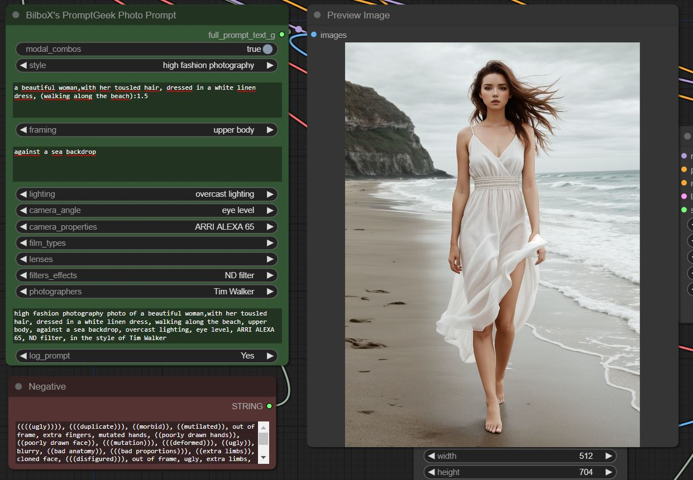
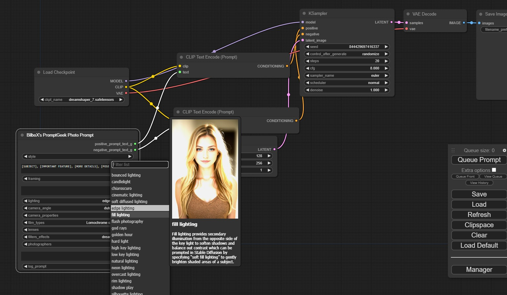
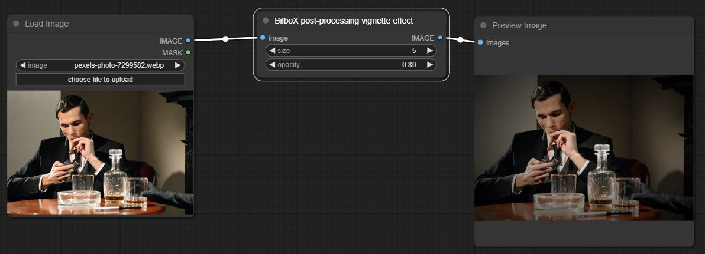
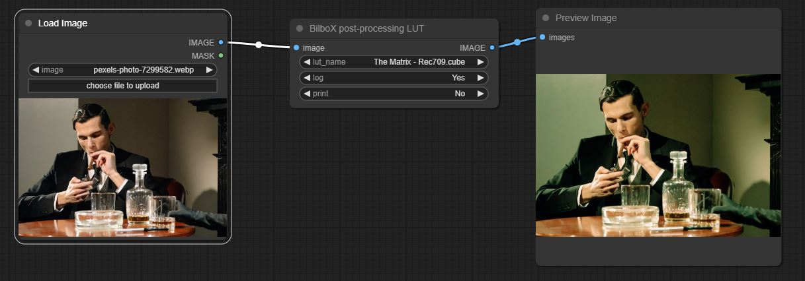

# Ruben-BilboX's ComfyUI Custom Nodes

Various custom nodes for ComfyUI, based on the work by Bilbox.

## Description

This repository is a modification of [BilboX's ComfyUI Custom Nodes](https://github.com/syllebra/bilbox-comfyui.git), so that they work with the newer versions of [ComfyUI](https://github.com/comfyanonymous/ComfyUI).

## Getting Started

### Dependencies

* Have a working installation of git.

### Installing

* Go to custom-nodes directory
* Clone this repository
* Restart ComfyUI interface

```
cd ComfyUI/custom-nodes
git clone https://github.com/RubenAlba95/ruben-bilbox-comfyui.git
```

## Nodes

### Ruben-BilboX's PromptGeek Photo Prompt
This is a node created from the awesome [PromptGeek's "Creating Photorealistic Images With AI: Using Stable Diffusion"](https://promptgeek.gumroad.com/photoreal) book data. It provides a convenient way to compose photorealistic prompts into ComfyUI. Now working wiht newer versions of ComfyUI.




### Post-Processing

#### Vignette effect
This is a fix and imprvement of [EllangoK's ComfyUI-post-processing-nodes](https://github.com/EllangoK/ComfyUI-post-processing-nodes) vignette effect.


Just two parameters: one for the size of effect and another for the opacity.

#### LUT color correction
This is an implementation as post processing effect in *Comfy-UI* of [Yoonsikp's pycubelut](https://github.com/yoonsikp/pycubelut).


There are two parameters. The first one is the name of the LUT file to apply. Simply put your lut files (currently only *.cube* support) in `custom_nodes/bilbox-comfyui/luts` or add your LUts directory in `custom_nodes/bilbox-comfyui/luts_directory.txt`.

The second parameter is an option to setup the output in the log color space.

An optinnal parameter is just used to debug and print informations about the lut file.


## Authors
* Code: BilboX, Rubendario Albarran Gonzalez
* Arts: [@PromptGeek Youtube](https://www.youtube.com/@PromptGeek)

## Version History
* 1.1
    * Modified so that it works with newer versions of ComfyUI

* 1.0.0
    * Fixed various bugs and added to comfy registry

* 0.3
    * Add post preocessing effects *LUT color correction* and *Vignette effect*
* 0.2
    * Updated Readme
    * See [commit change]() or See [release history]()
* 0.1
    * Initial Release

## License

This project is licensed under the MIT License - see the LICENSE.md file for details

## Acknowledgments
Source Inspiration
* [PromptGeek's "Creating Photorealistic Images With AI: Using Stable Diffusion" awesome book](https://promptgeek.gumroad.com/photoreal)
* [EllangoK's ComfyUI-post-processing-nodes](https://github.com/EllangoK/ComfyUI-post-processing-nodes)
* [Yoonsikp's pycubelut](https://github.com/yoonsikp/pycubelut)

Inspiration, code snippets, etc.

* [Readme-Template](https://gist.github.com/DomPizzie/7a5ff55ffa9081f2de27c315f5018afc)
